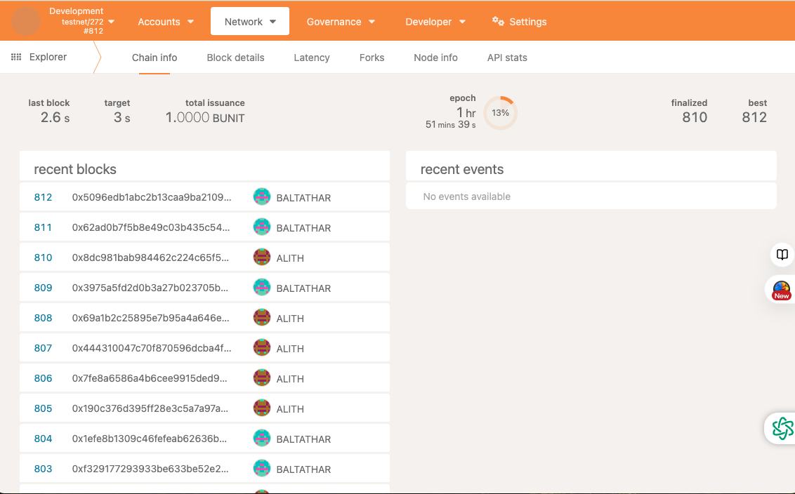
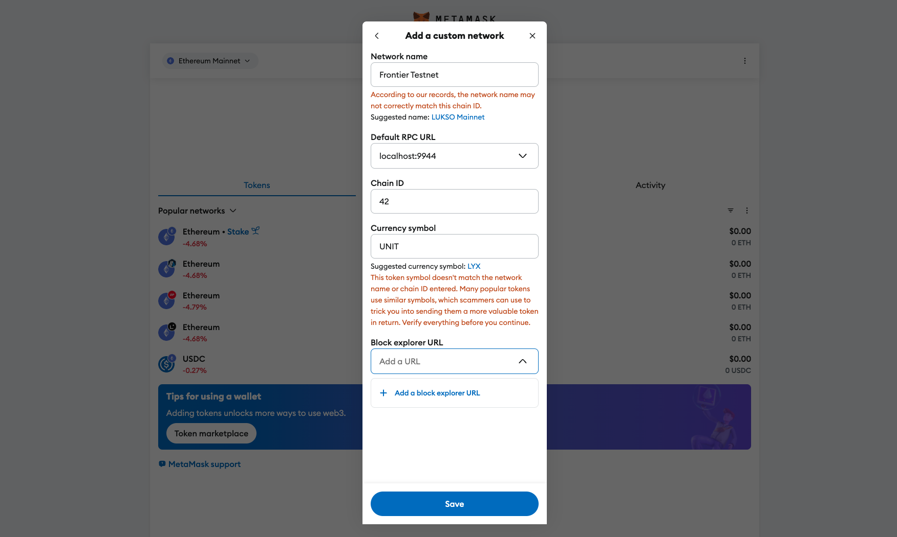

## install rust environment

[install rust environment](./install-environment.md)

## clone project

```
git clone https://github.com/ChainSupport/frontier-pos-template.git
cd frontier-pos-template
```

## build

[build local node](./build-node-local.md)
## run testnet node
```
./target/release/substrate --dev --alice
```

## Unit tests

```
 cargo test -p babe-consensus-data-provider -- --nocapture
```

```
cargo test -p ecdsa-keyring -- --nocapture
```

```
cargo test --features testnet -- --nocapture

```

```
cargo test --features mainnet -- --nocapture

```

## Generate test coverage report
todo 
## docker build

[build node docker](./build-node-docker.md)

## run by docker

```
docker-compose up
```

## Vist explorer



> Here, we can see that two nodes are randomly producing blocks, fully compatible with NPOS (Nominated Proof-of-Stake).

## Connect MetaMask Wallet

> The following steps assume that you have already created a wallet address. If you haven't created a wallet yet, please create one in MetaMask first.

1. Add your network to MetaMask.
    ```
    Network name: Frontier Testnet
    Default RPC URL: http://localhost:9944
    Chain ID: 42
    Currency symbol: UNIT
    ```
    

2. Connect to your network and copy your wallet address.
todo 

3. Use Alice to send a transaction to your wallet address in the explorer. Your MetaMask wallet will display the updated balance.
todo

## Run your scan (Blockscout)

> Transactions in the EVM can be viewed on this scan.
1. deploy
    ```
    git clone https://github.com/ChainSupport/blockscout.git
    cd blockscout/docker-compose
    ```

    ```
    docker-compose up --build
    ```

2. When you send a transaction to any address from MetaMask, you will find the transaction record on the scan.


## Deploy a smart contract to your network using Remix.

1. Visit Remix
    todo 
2. Select a node
    todo 
3. Compile and deploy the Lock smart contract
    todo

