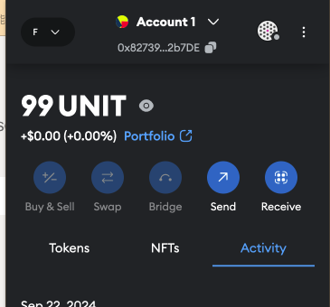
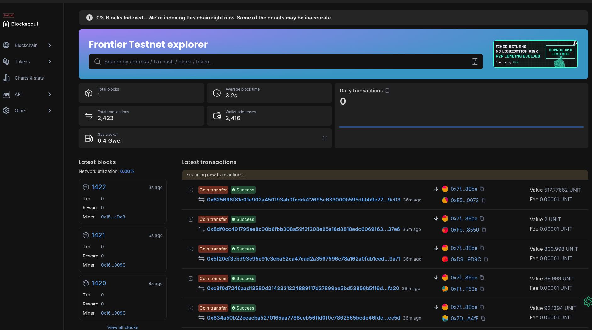

## install rust environment

[install rust environment](./install-environment.md)

## clone project

```
git clone https://github.com/ChainSupport/frontier-pos-template.git
cd frontier-pos-template
```

## build

[build local node](./build-node-local.md)
## run testnet node
```
./target/release/substrate --dev --alice
```

## Unit tests

```
 cargo test -p babe-consensus-data-provider -- --nocapture
```

```
cargo test -p ecdsa-keyring -- --nocapture
```

```
cargo test --features testnet -- --nocapture

```

```
cargo test --features mainnet -- --nocapture

```

## Generate test coverage report
```
cargo tarpaulin --out html --run-types Tests
```
## docker build

[build node docker](./build-node-docker.md)

## run by docker

```
docker-compose up
```

## Vist [explorer](https://polkadot.js.org/apps/?rpc=ws%3A%2F%2F127.0.0.1%3A9944#/explorer)


> Here, we can see that two validators are randomly producing blocks, fully compatible with NPOS (Nominated Proof-of-Stake).

## Connect MetaMask Wallet

> The following steps assume that you have already created a wallet address. If you haven't created a wallet yet, please create one in MetaMask first.

1. Add your network to MetaMask.
    ```
    Network name: Frontier Testnet
    Default RPC URL: http://localhost:9944
    Chain ID: 42
    Currency symbol: UNIT
    ```
    

2. Connect to your network and copy your wallet address.
    1. select network
        
        
    2. copy your address
        

3. Use `CHARLETH` to transfer UNIT to your wallet address in the [explorer](https://polkadot.js.org/apps/?rpc=ws%3A%2F%2F127.0.0.1%3A9944#/accounts). Your MetaMask wallet will display the balance.
    1. transfer 
        
    2. balance
        

## Run your scan (Blockscout)

> Transactions in the EVM can be viewed on this scan.
1. deploy
    ```
    git clone https://github.com/ChainSupport/blockscout.git
    cd blockscout/docker-compose
    ```

    ```
    docker-compose up --build
    ```

2. When you send token to any address from MetaMask, you will find the transfer record on the [scan](http://localhost/).
    1. Send token by MetaMask
        
    2. transactions
        

> Note: Currently, Blockscout does not support displaying native transfer records, meaning transactions made through the `Balances` pallet are not shown here. (We plan to provide support for this in the future.)
## Deploy a smart contract to your network using Remix.

1. Visit Remix
    todo 
2. Select a node
    todo 
3. Compile and deploy the Lock smart contract
    todo

