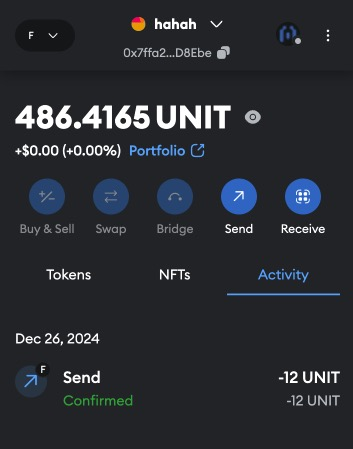

## install rust environment

[install rust environment](./install-environment.md)

## clone project

```
git clone https://github.com/ChainSupport/frontier-pos-template.git
cd frontier-pos-template
```

## build

[build local node](./build-node-local.md)
## run testnet node
```
cargo build --release --features testnet
./target/release/substrate --dev --alice
```

## Unit tests

```
cargo test -p babe-consensus-data-provider -- --nocapture
cargo test -p ecdsa-keyring -- --nocapture
```

## Generate test coverage report

```
cargo clean
cargo tarpaulin --out html --run-types Tests -p babe-consensus-data-provider
```

```
cargo clean
cargo tarpaulin --out html --run-types Tests -p ecdsa-keyring
```

## Cargo clippy

```
cargo clippy --features testnet
cargo clippy --features mainnet
```

## docker build

[build node docker](./build-node-docker.md)

## run by docker

```
docker-compose up
```

## Vist [explorer](https://polkadot.js.org/apps/?rpc=ws%3A%2F%2F127.0.0.1%3A9944#/explorer)


> Here, we can see that two validators are randomly producing blocks, fully compatible with NPOS (Nominated Proof-of-Stake).

## Connect MetaMask Wallet

> The following steps assume that you have already created a wallet address. If you haven't created a wallet yet, please create one in MetaMask first.

1. Add your network to MetaMask.
    ```
    Network name: Frontier Testnet
    Default RPC URL: http://localhost:9944
    Chain ID: 42
    Currency symbol: UNIT
    ```
    <div align="center">
    
    </div>

    <!--  -->

2. Connect to your network and copy your wallet address.
    1. select network
    <div align="center">
    
    </div>
    2. copy your address
        <div align="center">
        
        </div>

3. Use `CHARLETH` to transfer UNIT to your wallet address in the [explorer](https://polkadot.js.org/apps/?rpc=ws%3A%2F%2F127.0.0.1%3A9944#/accounts). Your MetaMask wallet will display the balance.
    1. transfer 
        <div align="center">
        
        </div>
    2. balance
        <div align="center">
        
        </div>

## Run your scan (Blockscout)

> Transactions in the EVM can be viewed on this scan.
1. deploy
    ```
    git clone https://github.com/ChainSupport/blockscout.git
    cd blockscout/docker-compose
    ```

    ```
    docker-compose up --build
    ```

2. When you send token to any address from MetaMask, you will find the transfer record on the [scan](http://localhost/).
    1. Send token by MetaMask
        <div align="center">
        
        </div>
    2. transactions  
        <div align="center">
        
        </div>

> Note: Currently, Blockscout does not support displaying native transfer records, meaning transactions made through the `Balances` pallet are not shown here. (We plan to provide support for this in the future.)
## Deploy a smart contract

### Option 1: Remix
1. Visit [Remix](https://remix.ethereum.org/#)
   
    
2. Select a network
    
3. Compile and deploy the smart contract
    1. Compoile
        
    2. deploy
        

### Option 2: hardhat
[https://hardhat.org/tutorial](https://hardhat.org/tutorial)